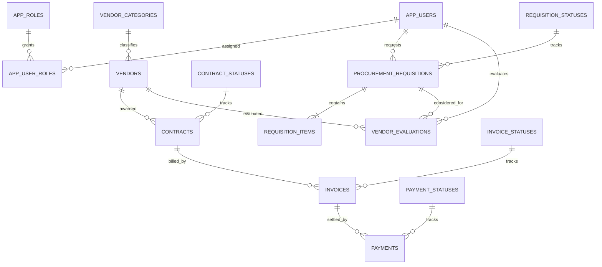

# J14 Database ER Diagram

Oracle Database 21c XE, schema in `schema.sql`.

```mermaid
erDiagram
  APP_USERS ||--o{ APP_USER_ROLES : assigned
  APP_ROLES ||--o{ APP_USER_ROLES : grants
  VENDOR_CATEGORIES ||--o{ VENDORS : classifies
  VENDORS ||--o{ CONTRACTS : awarded
  CONTRACT_STATUSES ||--o{ CONTRACTS : tracks
  APP_USERS ||--o{ PROCUREMENT_REQUISITIONS : requests
  REQUISITION_STATUSES ||--o{ PROCUREMENT_REQUISITIONS : tracks
  PROCUREMENT_REQUISITIONS ||--|{ REQUISITION_ITEMS : contains
  PROCUREMENT_REQUISITIONS ||--o{ VENDOR_EVALUATIONS : considered_for
  VENDORS ||--o{ VENDOR_EVALUATIONS : evaluated
  APP_USERS ||--o{ VENDOR_EVALUATIONS : evaluates
  CONTRACTS ||--o{ INVOICES : billed_by
  INVOICE_STATUSES ||--o{ INVOICES : tracks
  INVOICES ||--o{ PAYMENTS : settled_by
  PAYMENT_STATUSES ||--o{ PAYMENTS : tracks
```
